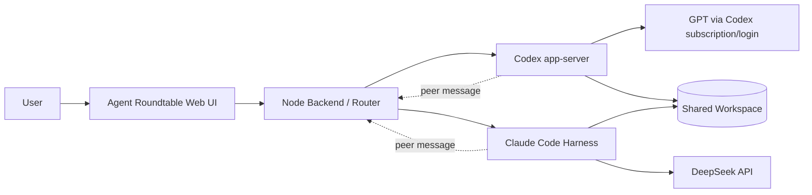

# Agent Roundtable — Design V0.1

> 状态：**方案冻结，尚未开始业务代码实现**  
> 目标：构建一个本地 Roundtable UI，让 **Codex Harness + GPT** 与 **Claude Code Harness + DeepSeek** 围绕同一个真实代码工作区独立讨论、按需加入、互相 Review。

## 1. 核心定位

Agent Roundtable **不是重新实现 Coding Agent**，也不额外引入第三个 LLM。

它只负责：

- 本地聊天 UI；
- 会话管理；
- Agent 路由；
- 上下文搬运；
- 双 Agent 讨论 / Review 编排；
- 清晰展示每条消息来自谁。

真正的代码理解、工具调用、MCP、Agent Loop 和工作区操作仍由各自 Harness 负责：

- **Codex Harness + GPT**；
- **Claude Code Harness + DeepSeek**。

两端共享同一个真实 workspace，因此任何结论都应基于当前工作区独立验证，而不是只相信对方转述。

---

## 2. 总体架构



### 前端

- React
- TypeScript
- Vite
- assistant-ui

### 后端

Node 服务负责：

- 保存 Roundtable 会话；
- 把用户消息路由给指定 Agent；
- 调用 Codex / Claude Code 的本地接口；
- 在 Review / Cross Review 时搬运对方输出；
- 给所有消息附加明确身份 metadata。

---

## 3. 两个 Agent 如何接入

### 3.1 Codex

通过 **`codex app-server`** 接入。

原则：

- 继续使用本机 Codex / ChatGPT 登录态；
- 继续使用用户已有的 Codex 订阅额度；
- **不要求 OpenAI API Key**；
- Roundtable 不模拟 Codex，只连接 Codex Harness 本身。

### 3.2 DeepSeek

DeepSeek **必须运行在 Claude Code Harness 内**，不是 Roundtable 后端直接裸调 DeepSeek API。

由 Claude Code 继续负责：

- session；
- context；
- tools；
- MCP；
- agent loop；
- model provider。

即：

```text
Roundtable -> Claude Code Harness -> DeepSeek
```

而不是：

```text
Roundtable -> DeepSeek API
```

这样才能保留 Claude Code 作为完整 Coding Agent Harness 的能力。

---

## 4. 用户真实使用方式

### 4.1 默认可以只和一个 Agent 聊

用户不需要每次都启动“双模型会议”。

例如可以长期：

```text
You -> Codex -> You -> Codex ...
```

或者：

```text
You -> Claude Code · DeepSeek -> You -> Claude Code · DeepSeek ...
```

需要第二个 Agent 时，再点击 **Invite** 或显式 @ 它加入当前话题。

### 4.2 输入路由

支持：

- `@Codex`
- `@DeepSeek`
- `@Both`

其中 `@Both` 默认采用 **Parallel**：两边同时独立回答，并且在首轮回答前互相看不到对方内容，避免 anchoring。

---

## 5. V0.1 讨论模式

### Manual（默认）

用户手动指定谁回答。

适合日常使用，控制最明确。

### Review

```text
User -> Codex -> DeepSeek Review Codex
```

先由 Codex 给出方案，再让 DeepSeek 检查问题、遗漏和风险。

### Reverse Review

```text
User -> DeepSeek -> Codex Review DeepSeek
```

与 Review 相反。

### Parallel

```text
          -> Codex
User -----|
          -> DeepSeek
```

双方独立思考，不先读取对方答案，然后并列展示。

### Cross Review

```text
User
 ├─> Codex original
 └─> DeepSeek original

Codex      -> review DeepSeek original
DeepSeek   -> review Codex original
```

Roundtable 保留：

1. Codex 原始观点；
2. DeepSeek 原始观点；
3. Codex 对 DeepSeek 的 Review；
4. DeepSeek 对 Codex 的 Review。

**Roundtable 不自动选赢家，也不额外调用第三个模型做裁判。**

### 不做默认无限 Debate

V0.1 不让两个 Agent 自动无限互怼。

若需要继续讨论，由用户显式触发下一轮，例如：

- “让 Codex 回应 DeepSeek 这条意见”；
- “让 DeepSeek 再检查 Codex 的修改建议”。

这样更可控，也避免 token 和上下文无意义膨胀。

---

## 6. Agent 身份必须清晰

UI 中固定展示：

- `You`
- `Codex · GPT`
- `Claude Code · DeepSeek`

消息模型至少包含：

```ts
type Author = "user" | "codex" | "claude-deepseek";

type RoundtableMessage = {
  id: string;
  author: Author;
  content: string;
  createdAt: string;
  replyTo?: string;
};
```

不能只靠气泡颜色区分身份，消息数据本身必须明确记录 author。

---

## 7. Agent 之间如何传递信息

一个 Agent 的输出需要交给另一个 Agent Review 时，不伪装成用户消息，而是显式包装为 peer message，例如：

```xml
<peer_message author="codex">
...
</peer_message>
```

同时在系统提示中明确：

> 这是另一 Agent 的观点，不保证正确。请结合当前真实 workspace、代码和工具结果自行验证。

目的：

- 防止来源混淆；
- 防止 Agent 把对方的话当成用户指令；
- 强制 Reviewer 独立验证；
- 为后续 trace / replay 留下明确结构。

---

## 8. 上下文原则

Roundtable 只负责 **会话级上下文编排**，不替代 Harness 自己的上下文机制。

需要区分三类信息：

1. **用户与某 Agent 的原生会话上下文**：由对应 Harness 维护；
2. **Roundtable UI 的统一消息历史**：用于展示、恢复会话和路由；
3. **跨 Agent 上下文**：只在 Invite / Review / Cross Review 等明确动作发生时搬运必要内容。

V0.1 不默认把全部历史完整复制给另一个 Agent，避免：

- 上下文爆炸；
- 不必要 token 消耗；
- Agent 身份边界变模糊。

---

## 9. V0.1 关键交互

主界面至少需要：

- 一个统一聊天时间线；
- 当前 active Agent；
- `Invite Codex / Invite DeepSeek`；
- `@Codex / @DeepSeek / @Both`；
- 讨论模式选择：Manual / Review / Reverse Review / Parallel / Cross Review；
- 每条消息的 Agent 身份标识；
- 当前 workspace 标识；
- Agent 在线 / session 状态。

---

## 10. V0.1 非目标

暂不做：

- 自己实现 Coding Agent Loop；
- 自己实现 shell / file tools 来替代 Codex 或 Claude Code；
- 第三个“主持人 / 裁判 LLM”；
- 自动无限 Debate；
- 自动决定哪个 Agent 正确；
- 复杂多 Agent workflow DSL；
- 云端 SaaS 化；
- 多人协作权限系统。

先把两个现成 Harness **稳定接进同一个 UI，并实现可靠的双 Agent 上下文路由**。

---

## 11. 建议的实现顺序

### Phase 1 — 单 Agent 通路

1. 初始化 Web UI + Node backend；
2. 接通 Codex `app-server`；
3. UI 中完成 `You <-> Codex` 连续会话；
4. 接通 Claude Code Harness + DeepSeek；
5. UI 中完成 `You <-> Claude Code · DeepSeek` 连续会话。

### Phase 2 — Roundtable 路由

6. 实现统一 message schema；
7. 实现 `@Codex / @DeepSeek / @Both`；
8. 实现 Invite；
9. 实现 Parallel。

### Phase 3 — 双 Agent Review

10. 实现 peer message；
11. 实现 Review；
12. 实现 Reverse Review；
13. 实现 Cross Review；
14. 增加 trace，确保能清楚看到每一轮是谁收到什么、回复什么。

### Phase 4 — 稳定性

15. session 恢复；
16. Harness 断连处理；
17. workspace 一致性检查；
18. 长上下文裁剪与跨 Agent 上下文摘要策略。

---

## 12. V0.1 成功标准

V0.1 完成时应满足：

- 可以只和 Codex 连续讨论；
- 可以只和 Claude Code + DeepSeek 连续讨论；
- 任意时刻可以邀请另一 Agent 加入；
- 两个 Agent 操作 / 阅读的是同一个 workspace；
- `@Both` 可以真正并行独立回答；
- 可以进行 Codex -> DeepSeek Review 和反向 Review；
- 可以完成 Cross Review；
- UI 和数据层都能准确区分消息来源；
- 跨 Agent 传递的信息不会伪装成用户指令；
- Roundtable 本身不重新实现 Codex / Claude Code 的 Coding Agent 能力。

这就是 Agent Roundtable V0.1 的冻结边界。后续代码实现应以本设计为准，除非方案再次显式更新。
